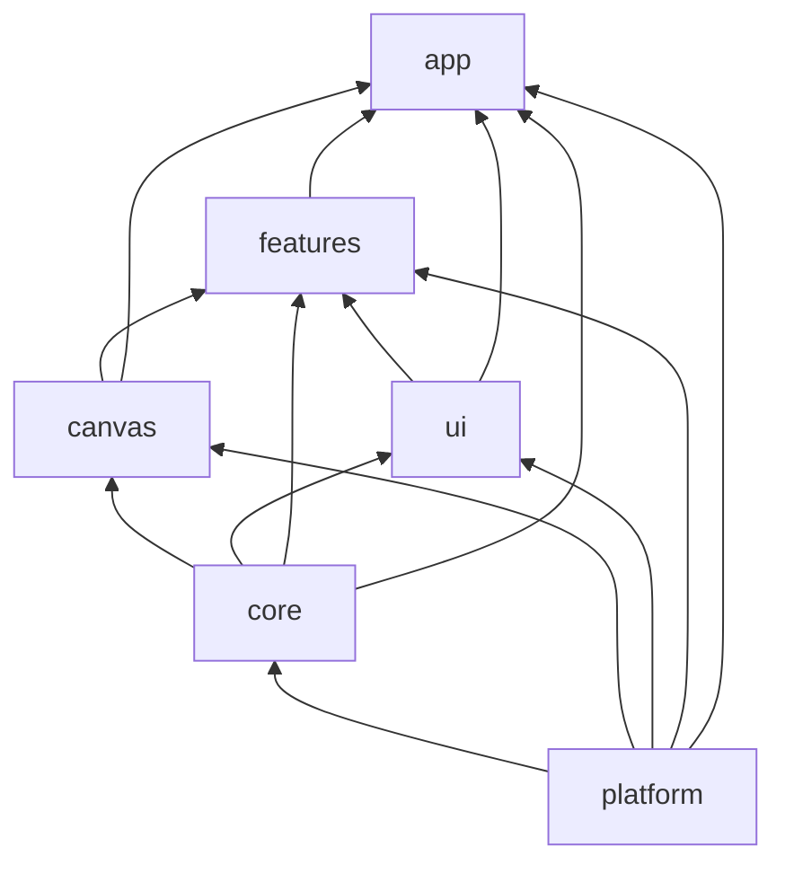
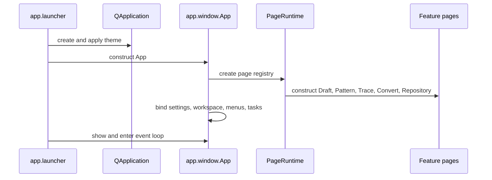

# Simple Stipple architecture

Simple Stipple is a PySide6 desktop application for drafting vector geometry,
tracing raster imagery, generating pattern fills, and preparing laser/vector
files. It is a modular monolith: one installed Python package and one desktop
process, with clear capability boundaries instead of network services.

This document is the versioned onboarding reference for package ownership,
runtime flow, extension points, and the checks that protect its boundaries.

## Run and verify

```bash
python -m pip install -e .[dev]
python -m simple_stipple
QT_QPA_PLATFORM=offscreen pytest -q tests/test_ui_audit_remediations.py
ruff check src tests
```

`simple_stipple.app.launcher:main` is the console-script entry point. The root
`main.py` remains a compatibility launcher for existing developer workflows.

## The seven capability homes

| Home | Owns | Never put here |
|---|---|---|
| `core/` | Qt-free logic: document state, CAD, geometry, editing, patterns, imaging, formats | Qt imports or application state |
| `platform/` | settings, paths, storage, updates, reporting, bootstrap | product or canvas behavior |
| `canvas/` | the vector editor: rendering, tools, selection, layers, canvas UI | page-specific Pattern/Trace rules |
| `ui/` | shared Qt controls, dialogs, theme and icons | canvas-specific configuration |
| `features/` | Draft, Pattern, Trace, Convert, Repository, Help workflows | cross-feature utility dumping grounds |
| `app/` | startup, window, navigation, menus, app-wide tasks | geometry or reusable canvas tools |
| `resources/` | packaged DXF tiles and other runtime data | executable code |

`core/` is defined by one testable rule: **if it does not import Qt, it belongs
in `core/`.** That replaces the older `engine/` vs `document/` split, which
forced an unanswerable question ("is this document state or an algorithm?") for
modules like `cad/editor_geometry.py` and `cad/preflight.py`.

Within `core/`, `document/` owns editable state, commands, history, and the
workspace schema; the remaining subpackages are stateless algorithms. Only
`core.document.identity` may be imported by the algorithmic subpackages —
enforced by `test_core_algorithms_may_only_reach_document_identity`.

Avoid `common`, `helpers`, `misc`, and `utils`. Extract code only when it has a
real second consumer or needs its own dependency boundary. The project favors a
small number of clear modules over a forest of tiny files.

## Dependency direction



The diagram is a navigation guide. The executable rules in
[`tests/test_dependency_boundaries.py`](tests/test_dependency_boundaries.py)
are authoritative:

1. `platform` has no product, UI, or core dependencies.
2. `core` is Qt-free and never imports app, canvas, UI, or features.
   Algorithmic subpackages may reach `core.document.identity` and nothing else
   under `core.document`.
3. `canvas` imports neither `app` nor product features.
4. Features never import one another’s internals; shared page behavior belongs
   in `features.base`.
5. `ui` never imports `canvas`; canvas-only configuration dialogs belong in
   `canvas/dialogs/`.
6. `app` is the composition root and may coordinate every capability home.

## Public surfaces

- `simple_stipple.app.launcher:main` — console-script and module entry point.
- `simple_stipple.app.pages.default_page_specs` — top-level workflow registry.
- `simple_stipple.core.document.service.DocumentService` — command-oriented mutation,
  history, and document-notification boundary.
- `simple_stipple.canvas.widget.DxfCanvas` — reusable interactive vector editor.
- `simple_stipple.ui.components` and `simple_stipple.ui.dialogs` — shared,
  presentation-only Qt controls and dialogs.

## Startup and page lifecycle



`app/pages.py` is the only top-level tab registry. To add a user workflow,
create an isolated feature package, expose its page, add one `PageSpec` in
`default_page_specs()`, and implement workspace methods only if the page owns
persistent state.

## Core execution paths

### Edit geometry

`editor.widget.DxfCanvas` turns pointer and keyboard interaction into editor
operations and `document.service.DocumentService` commands. The service owns
mutation, validation, undo/redo history, and change notifications. Widgets
should not mutate `CanvasDocument` directly when a change must be undoable.

### Import and export

Feature pages own user intent, dialogs, progress, cancellation, and visible
status. `engine.formats` owns parsing and serialization; `engine.cad` owns
shape semantics. This keeps file code Qt-free and reusable across workflows.

### Pattern and imaging

`features.pattern.outline_state` handles pure outline normalization, identity
reconciliation, records, layers, bounds, and containment. `engine.patterns`
generates fills. `PatternPage` coordinates Qt controls, workers, preview,
cancellation, and export. Trace follows the same division: `TracePage` owns
interaction while `engine.imaging` owns image processing.

## Placement guide

| Change | Start in | Primary surface |
|---|---|---|
| window chrome, menus, tab registration | `app/` | `App`, `PageRuntime`, `MenuController` |
| entities, commands, undo/redo, workspace JSON | `core/document/` | `CanvasDocument`, `DocumentService` |
| pointer tools, snapping, scene paint, layers | `canvas/` | `DxfCanvas`, `CanvasRenderer` |
| CAD algorithms, DXF/SVG/FVI, raster/vector processing | `core/` | CAD, formats, imaging, patterns |
| a page-visible workflow | `features/<workflow>/` | the feature’s `*Page` |
| shared Qt control or visual token | `ui/` | components/dialogs or `theme.qss` |
| settings, OS paths, storage, update/reporting | `platform/` | `platform.settings` |

## Working conventions

- Prefer semantic widget properties such as `role="primary"` and existing
  `theme.qss` roles over local stylesheets and hardcoded colors.
- Let layouts negotiate width. Fixed sizes are for icon-only controls and
  documented interaction targets; cover unavoidable fixed sizes with a
  narrow-width test.
- Preserve public patch points when extracting a seam. For example, CanvasView
  retains its public methods while `editor.view.preferences` owns preferences.
- Keep behavior with its tests. `test_dependency_boundaries.py` and
  `test_module_homes.py` protect the top-level architecture.

## Important extension seams

- `features.pattern.outline_state` — non-Qt Pattern outline state.
- `editor.rendering.dense_preview` — retained preview batching and raster cache.
- `editor.view.preferences` — grid, snap, context-menu, and status settings.
- `engine.cad.curves` — spline and Bezier control-point behavior.
- `features.trace.dxf_export` — outlined-DXF export workflow.
- `features.draft.svg_backdrop` — imported SVG reference-artwork lifecycle.
- `ui.components.{units,notifications,recent}` and `ui.dialogs.files` — shared
  UI behavior not specific to the editor.

## Tests and release checks

Use focused tests while changing a feature, then run the full suite in a stable
Qt environment. Some local combined PySide6 runs have hit a `QListWidgetItem`
teardown crash; record the exact command/output and do not report a missing
terminal summary as a passing full run.

Release verification builds an sdist and wheel, installs the wheel in an
isolated environment, verifies packaged `theme.qss` and DXF resources, and
performs an offscreen app-startup smoke test.
