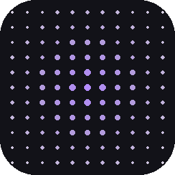

# Simple Stipple

<p align="center">
  
</p>

<p align="center"><strong>Design, pattern, trace, and export vector geometry for laser workflows.</strong></p>

<p align="center">
  <a href="https://github.com/KiidxAtlas/simple-stipple/releases/latest">Download the latest release</a>
  ·
  <a href="https://github.com/KiidxAtlas/simple-stipple/issues">Report a problem</a>
  ·
  <a href="https://github.com/KiidxAtlas/simple-stipple/discussions">Ask a question</a>
</p>

<p align="center">
  <a href="https://github.com/KiidxAtlas/simple-stipple/actions/workflows/quality.yml"></a>
  <a href="https://github.com/KiidxAtlas/simple-stipple/releases"></a>
  <a href="https://github.com/KiidxAtlas/simple-stipple/blob/main/SECURITY.md"></a>
</p>

Simple Stipple is a local-first desktop tool for makers, laser operators, and vector workflows. Start with a hand-drawn outline, an existing CAD file, or an image; refine it; generate a repeatable pattern; and export geometry for the machine software you already use.

> **Release status:** pre-1.0. Always inspect exported files in your machine software before running a job. Simple Stipple prepares geometry; it does not control laser hardware.

## Why use it?

- **One canvas for the whole job** — draft, edit, organize, and inspect geometry without jumping between tools.
- **Repeatable pattern generation** — tune dimensions, spacing, density, rotation, zones, and saved presets instead of hand-editing thousands of paths.
- **Image-to-vector workflow** — trace raster artwork into editable outlines, then send it to Draft or Pattern.
- **Production-aware exports** — export DXF, SVG, FVI, or a LaserStar package with visible preflight and status feedback.
- **Recoverable workspaces** — save pages, geometry, parameters, and settings together; autosave and recovery snapshots help protect unfinished work.
- **Local-first operation** — no account is required. Optional update checks, repository sync, and crash reporting are separate capabilities.

## The workflow

| Goal | Start here | Result |
| --- | --- | --- |
| Draw or clean a part | **Draft** | Editable 2D geometry with layers, snapping, constraints, curves, dimensions, and DXF/SVG import/export |
| Create an engraving texture | **Pattern** | Vector patterns clipped to closed outlines, with presets, zones, exclusions, and custom tiles |
| Turn a photo or logo into paths | **Trace** | Editable vector outlines from PNG, JPG/JPEG, BMP, TIFF, GIF, or WebP images |
| Repair or translate files | **Convert** | FVI → DXF, SVG ↔ DXF utilities, and DXF cleanup |

Included pattern generators cover Honeycomb, Basketweave, Brick, Knurling, Mesh, Seigaiha, Stipple Dots, Truchet, Voronoi, and custom tiles.

## Download the desktop app

Prebuilt artifacts are published on the [Releases page](https://github.com/KiidxAtlas/simple-stipple/releases):

- **Windows:** `SimpleStipple.exe`
- **macOS:** `SimpleStipple-macOS.dmg`

Each artifact includes a `.sha256` checksum. Windows can also check for verified updates from **Help → Check for Updates**. macOS releases require signing and notarization before publication.

For a source install, see the instructions below. Linux users can run from source; packaged Linux artifacts are not currently published.

## Quick start from source

Requires Python 3.10 or newer.

```bash
python -m pip install -e .
python -m simple_stipple
```

Or install the command entry point with `pipx`:

```bash
pipx install .
simple-stipple
```

Optional CAD/constraint support:

```bash
python -m pip install -e '.[cad]'
```

### First pattern in six steps

1. Open **Pattern** (or press `Alt+2`).
2. Draw a closed outline or import DXF, FVI, or SVG.
3. Choose a pattern such as **Honeycomb** or **Stipple Dots**.
4. Adjust size, spacing, density, and any zone treatments.
5. Generate and inspect the result in the canvas.
6. Export, then verify scale, units, layers, and operation order in your machine software.

For the complete in-app guide, use **Help → User Manual**. The architecture and extension boundaries are documented in [ARCHITECTURE.md](ARCHITECTURE.md).

## File and safety notes

- FVI support is intentionally geometry-only: `MOVEDIST`, `DRAWLINE`, and `DRAWARC` are supported. Hardware I/O, loops, file calls, laser parameters, and Z-axis motion are reported but never executed or generated.
- A workspace file preserves editable project state; DXF, SVG, and FVI exports are interchange or production files, not full workspace backups.
- Always use your machine software's preview/profile simulation. Confirm scale, units, layers, travel moves, power, speed, focus, and material before enabling the laser.
- Do not open untrusted files on production equipment without reviewing the resulting geometry first.

## Development

```bash
uv sync --extra dev
uv run ruff check .
uv run ruff format --check .
uv run pytest -q
uv run mypy src
uv run pyright
```

The canonical release checklist is [docs/RELEASE_CHECKLIST.md](docs/RELEASE_CHECKLIST.md). Contributors can start with [CONTRIBUTING.md](CONTRIBUTING.md); security reports belong in the private channel described by [SECURITY.md](SECURITY.md).

## Support and feedback

- [Open a bug report](https://github.com/KiidxAtlas/simple-stipple/issues/new?template=bug_report.yml)
- [Request an idea or workflow](https://github.com/KiidxAtlas/simple-stipple/issues/new?template=feature_request.yml)
- [Browse existing discussions](https://github.com/KiidxAtlas/simple-stipple/discussions)
- [Support development](https://buymeacoffee.com/kiidxatlas)

Useful reports include the Simple Stipple version, operating system, source file type, exact steps, expected result, actual result, and a sanitized log excerpt. Do not attach private designs or credentials.

## Project links

- [Releases](https://github.com/KiidxAtlas/simple-stipple/releases)
- [Changelog](CHANGELOG.md)
- [Architecture guide](ARCHITECTURE.md)
- [Release checklist](docs/RELEASE_CHECKLIST.md)
- [Contributing](CONTRIBUTING.md)
- [Security policy](SECURITY.md)
- [MIT license](LICENSE)
